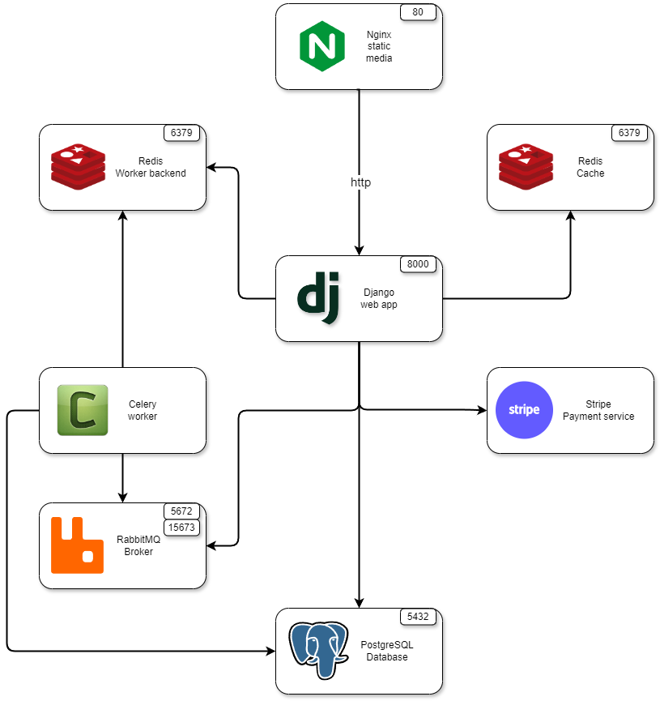
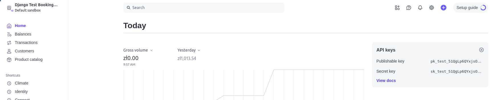

# Booking flights


<div>
  
  
  
  
  
  
  
</div>

### An application for booking flights
1. You can view a list of cities and destinations
2. You can view a list of planes
3. You can book flights
4. You can download your tickets

## Application structure



## Installation

### Stripe
You will need to register with the [Stripe service](https://stripe.com/) and create a dashboard. Once you have created a dashboard, you can use the API secret key.




### Docker
The most convenient and easiest way to launch a project is to use Docker.

1. Copy the contents of the `example.env` file into the `.env` file, and then complete it with your own data.
```shell
cp example.env .env
```
2. Now you can run the containers.
```shell
docker compose build
docker compose up -d
```
